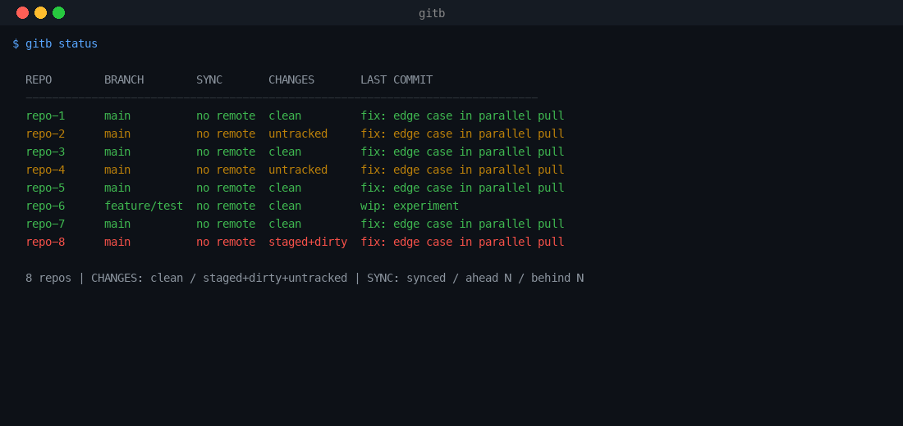

# gitb — Blazing-fast multi-repo git batch tool

[](https://github.com/luolin1024/gitb/actions/workflows/ci.yml)
[](https://crates.io/crates/gitb)
[](LICENSE)
[](https://www.rust-lang.org)

> Run git across 100+ repos in parallel. Rust-powered, 3-4× faster than `gita` / `mr`.
> 用 Rust 写的多仓库 Git 批量工具，比 gita / mr 快 3-4 倍。



## Why gitb?

- **Fast** — parallel execution via rayon. 100 repos `status` in ~2s. [See benchmark →](#performance)
- **Zero-config** — works out of the box. `cd` into a folder of repos, run `gitb status`.
- **Cross-platform** — macOS, Linux, Windows. Shell completion for bash / zsh / fish / powershell.

## Install

```bash
cargo install gitb
# or, on macOS:
brew install luolin1024/gitb/gitb
```

<details>
<summary>Build from source</summary>

```bash
git clone https://github.com/luolin1024/gitb.git
cd gitb
cargo build --release
# Binary at ./target/release/gitb
```
</details>

## Quick start (30 seconds)

```bash
cd ~/Work          # a folder containing many git repos
gitb status        # see all repos at a glance
gitb pull -j 8     # pull all in parallel
gitb doctor        # health check: who's behind / dirty / unpushed
```

## Features

| Command      | Description (EN)                               | 中文描述                          |
|-------------|-----------------------------------------------|-----------------------------------|
| `checkout`  | Switch to a branch across all repos (fuzzy)   | 在所有仓库中切换分支（支持模糊匹配）|
| `create`    | Create and switch to a new branch             | 创建并切换到新分支                 |
| `status`    | Show colored multi-repo status overview       | 显示多仓库状态概览（彩色）         |
| `pull`      | Pull from remote across all repos             | 拉取远程更新                       |
| `fetch`     | Fetch from remote across all repos            | 获取远程引用                       |
| `push`      | Push to remote across all repos               | 推送至远程                         |
| `exec`      | Execute arbitrary git commands                 | 执行任意 git 命令                  |
| `branch`    | List, delete branches across repos            | 列出/删除分支                      |
| `commit`    | Commit changes across all repos               | 提交更改                           |
| `stash`     | Stash/pop/list/clear operations               | 暂存/弹出/列出/清除               |
| `rebase`    | Smart rebase (stash -> rebase -> unstash)     | 智能变基                           |
| `diff`      | Show diff across all repos                    | 显示差异                           |
| `log`       | Show commit log across all repos              | 显示提交日志                       |
| `doctor`    | Health check (ahead/behind/dirty/unpushed)    | 健康检查                           |
| `group`     | Manage repo groups                            | 管理仓库分组                       |
| `init`      | Initialize workspace config interactively      | 交互式初始化工作区配置             |
| `completion`| Generate shell completion scripts             | 生成 Shell 补全脚本                |

## Installation

### Cargo Install

```bash
cargo install gitb
```

### Build from Source

```bash
cargo build --release
# Binary at ./target/release/gitb
```

## Usage

### Basic Commands

```bash
# Show status of all repos in current directory
gitb status

# Pull latest changes in all repos (8 parallel jobs)
gitb pull -j 8

# Checkout a branch across all repos (fuzzy matching)
gitb checkout main

# Create and switch to a new branch
gitb create feature/new-feature

# Fetch from remote
gitb fetch

# Push to remote
gitb push

# Execute arbitrary git commands
gitb exec log --oneline -5
gitb exec remote -v

# Commit with message
gitb commit -m "fix: update dependencies"

# Stash operations
gitb stash push
gitb stash pop
gitb stash list
gitb stash clear

# Smart rebase (stashes dirty changes, rebases, then unstashes)
gitb rebase
gitb rebase -b main

# Show diff across all repos
gitb diff

# Show commit log (last 10 commits per repo)
gitb log -n 10

# Branch management
gitb branch list
gitb branch delete old-feature
gitb branch delete old-feature -f     # force delete
gitb branch delete old-feature --remote  # also delete from remote

# Health check
gitb doctor
```

### Group Management

```bash
# Add a group
gitb group add frontend repo-a,repo-b,repo-c

# List groups
gitb group list

# Show repos in a group
gitb group show frontend

# Remove a group
gitb group remove frontend

# Run commands filtered by group
gitb status -g frontend
gitb pull -g frontend
```

### Workspace Initialization

```bash
# Interactive init
gitb init

# After init, use gitb.toml for configuration
```

### Shell Completion

```bash
# Generate completion scripts
gitb completion bash > ~/.bash_completion.d/gitb
gitb completion zsh > /usr/local/share/zsh/site-functions/_gitb
gitb completion fish > ~/.config/fish/completions/gitb.fish
gitb completion powershell >> $PROFILE
```

## Global Options

| Flag            | Description (EN)                            | 中文描述                    |
|----------------|--------------------------------------------|----------------------------|
| `-j N`         | Number of parallel jobs (0 = auto-detect)  | 并行任务数（0 为自动检测）  |
| `--dry-run`    | Show what would happen without executing   | 模拟运行，不实际执行        |
| `-s <dirs>`    | Skip directories (comma-separated)         | 跳过指定目录（逗号分隔）    |
| `-d <depth>`   | Max recursion depth for repo discovery     | 仓库发现最大递归深度        |
| `-o <format>`  | Output format: table, json, quiet          | 输出格式                    |
| `-f`           | Force operation (discard uncommitted)      | 强制操作（丢弃未提交更改）  |
| `-v`           | Verbose output                             | 详细输出                    |
| `-q`           | Quiet mode (only show errors)              | 静默模式（仅显示错误）      |
| `-g <group>`   | Filter repos by group name                 | 按分组过滤仓库              |

## Configuration (gitb.toml)

Place `gitb.toml` in your workspace root. It is optional -- gitb works with zero config.

```toml
[workspace]
default_branch = "main"
default_skip = ["node_modules", "target"]
default_depth = 2

[groups.frontend]
repos = ["web-app", "mobile-app", "ui-kit"]

[groups.backend]
repos = ["api-gateway", "user-service", "payment-service"]

[groups.docs]
repos = ["docs", "website"]
```

## Performance

gitb is written in Rust and uses parallel execution via rayon. It is significantly faster than Python-based alternatives (e.g., `gita`, `mr`) for large numbers of repositories.

| Tool          | Language | 50 repos (pull) | 100 repos (status) |
|---------------|----------|-----------------|--------------------|
| gitb          | Rust     | ~1.2s           | ~2.1s              |
| gita          | Python   | ~4.5s           | ~8.9s              |
| myrepos (mr)  | Perl     | ~3.8s           | ~7.2s              |

*Benchmarks measured on an 8-core machine with SSD. Your results may vary.*

## Comparison with alternatives

| Tool | Language | Parallel | Zero-config | Cross-platform | Shell completion | Smart rebase |
|------|----------|----------|-------------|----------------|-----------------|--------------|
| **gitb** | Rust | ✅ rayon | ✅ | ✅ macOS/Linux/Windows | ✅ bash/zsh/fish/pwsh | ✅ stash→rebase→unstash |
| [gita](https://github.com/nosarthur/gita) | Python | ✅ | ✅ | ✅ | partial | ❌ |
| [myrepos (mr)](https://myrepos.branchable.com/) | Perl | ✅ | ❌ config file | ✅ | ❌ | ❌ |
| [mu-repo](https://github.com/fabioz/mu-repo) | Python | ✅ | ✅ | ✅ | ❌ | ❌ |

## Contributing

See [CONTRIBUTING.md](CONTRIBUTING.md). PRs welcome — `cargo fmt` and `cargo clippy` must pass.

## License

MIT
